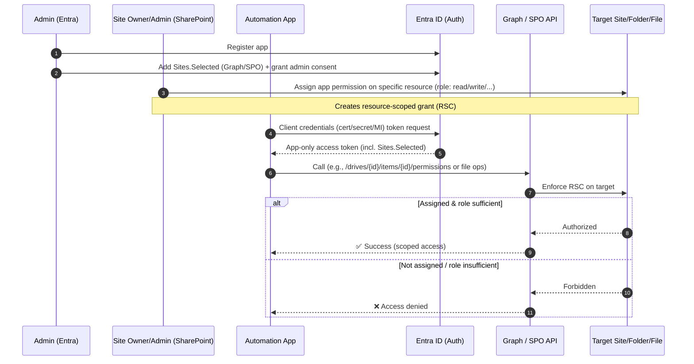

# Authentication Documentation

This folder contains guidance on how an organisation should authenticate applications that interact with Microsoft 365 services (SharePoint Online, Microsoft Graph).

Microsoft is deprecating the use of non-MFA accounts for authenticating against their products; this has been known since 2024 and looks to be happening on the **30th of September, 2025**. Any scripts that do not use an interactive authentication flow (i.e. background scripts, automation tasks, etc.) will stop working, and it looks like if you are using the third-party `Office365-REST-Python-Client` `.with_user_creds()` then your flow may already be breaking. For this we have made some short-term fixes which use the `UsernamePasswordCredential` from `azure-identity` (which uses `msal` under-the-hood); this works but is also deprecated according to the aforementioned notice.

The new approach uses **app-only authentication** with **resource-specific consent (RSC)** to achieve secure, fine-grained access.

## End-to-end flow

## Structure

- [Background](./background.md)
- [App Registration](./app-registration.md)
- [Resource-Specific Consent Overview](./rsc-overview.md)
- [Site Permissions](./site-permissions.md)
- [Folder & File Permissions](./folder-permissions.md)
- [Using Tokens in Scripts](./using-tokens.md)
- [Security Considerations](./security-considerations.md)
- [Migration Guide](./migration-guide.md)
